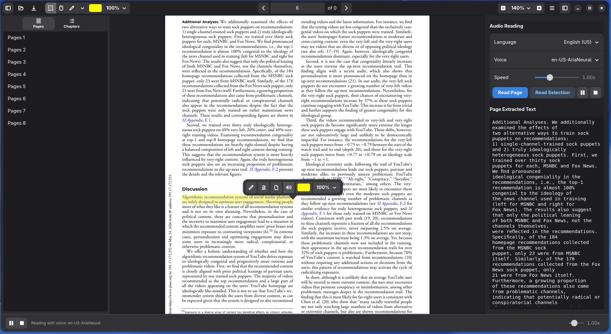

# NarroPDF

<p align="center">
  
</p>

**NarroPDF** é um leitor e anotador de arquivos PDF moderno, minimalista e acessível, desenvolvido em Python usando a biblioteca gráfica **GTK4** e **Libadwaita**. Ele combina visualização avançada de documentos, ferramentas de anotação de texto e um sintetizador de voz integrado (Text-to-Speech) com sincronização em tempo real.

---

## Funcionalidades Principais

- **Sintetizador de Voz (TTS) Integrado**: Escute seus PDFs em voz alta com sincronização em tempo real, acompanhando a barra de progresso inferior ou o painel lateral direito.
- **Controle de Velocidade**: Ajuste a velocidade da fala de `0.5x` até `2.0x` diretamente na interface (sincronizada nos sliders).
- **Anotações e Marcações**:
  - Realce (**Highlight**) e Sublinhado (**Underline**) de textos selecionados.
  - Seleção de cor customizada com suporte a opacidade via menu dropdown pré-definido (`10%`, `25%`, `50%`, `75%`, `80%`, `90%` e `100%`).
  - Função desfazer marcações (`Ctrl+Z`).
- **Navegação Eficiente**:
  - Clique simples para navegar por capítulos e páginas na barra lateral esquerda.
  - Arrastar para rolar a página (**Drag-to-Scroll**) suavemente.
  - Visualização em modo contínuo ou página única.
- **Atalhos Rápidos**:
  - `Ctrl + 4`: Modo Seleção.
  - `Ctrl + 1`: Modo Mão (Arrastar).
  - `1`: Modo Realce.
  - `2`: Modo Sublinhado.
  - `Ctrl + Z`: Desfazer anotação.
- **Segurança de Salvamento**: Avisa e pergunta se deseja salvar caso existam alterações pendentes ao fechar o aplicativo.
- **Interface Moderna**: Desenvolvido sob as diretrizes do GNOME, iniciando sempre maximizado e adaptável ao tamanho da tela.



---

## Instalação e Execução

### Pré-requisitos (Local)

Certifique-se de ter o Python 3.10+ instalado em seu sistema Linux. Instale as dependências necessárias (PyGObject, PyMuPDF, gTTS ou sintetizadores locais de acordo com sua distro):

```bash
# Instalar dependências de sistema (exemplo Fedora/Ubuntu)
sudo apt install python3-gi python3-gi-cairo gir1.2-gtk-4.0 gir1.2-adw-1
# Ou Fedora:
sudo dnf install python3-gobject gtk4 libadwaita

# Instalar pacotes python
pip install PyMuPDF gTTS
```

### Executando Localmente

```bash
python3 narro-pdf.py
```

---

## Empacotamento Flatpak

O projeto está totalmente configurado para ser compilado e distribuído via **Flatpak**, seguindo as melhores práticas e diretrizes visuais do ecossistema GNOME (como o ícone de aplicativo em formato de *squircle* minimalista).

### 1. Construir e Rodar Localmente (Modo Desenvolvimento)

```bash
# Compilar a aplicação
flatpak-builder --force-clean build-dir org.geraldohomero.NarroPdf.yaml

# Executar a aplicação compilada
flatpak-builder --run build-dir org.geraldohomero.NarroPdf.yaml org.geraldohomero.NarroPdf
```

### 2. Gerar o Instalador Único (`.flatpak`)

Para gerar um arquivo `.flatpak` instalável (pacote/bundle único completo que pode ser distribuído e instalado offline ou compartilhando o arquivo), execute:

```bash
# 1. Compilar exportando para um repositório local
flatpak-builder --repo=repo --force-clean build-dir org.geraldohomero.NarroPdf.yaml

# 2. Criar o pacote bundle (.flatpak)
flatpak build-bundle repo org.geraldohomero.NarroPdf.flatpak org.geraldohomero.NarroPdf
```

### 3. Instalar o arquivo `.flatpak` gerado

Com o arquivo `org.geraldohomero.NarroPdf.flatpak` em mãos, você ou qualquer outro usuário Linux pode instalá-lo facilmente:

```bash
# Instalar o arquivo .flatpak localmente
flatpak install --user org.geraldohomero.NarroPdf.flatpak
```

---

## Design do Ícone (Diretrizes Flatpak)

O ícone do aplicativo foi atualizado para alinhar-se perfeitamente com a especificação de design do **GNOME/Flatpak App Icons**:
- Base em formato *squircle* com a cor padrão azul Adwaita.
- Ilustração centralizada de uma folha de papel dobrada (representando o PDF) com o ícone de alto-falante integrado.
- Fundo transparente para adaptação nativa em qualquer tema ou dock do sistema.

---

## Licença

Este projeto está licenciado sob a licença descrita no repositório. Consulte os arquivos de código-fonte para obter mais detalhes.
